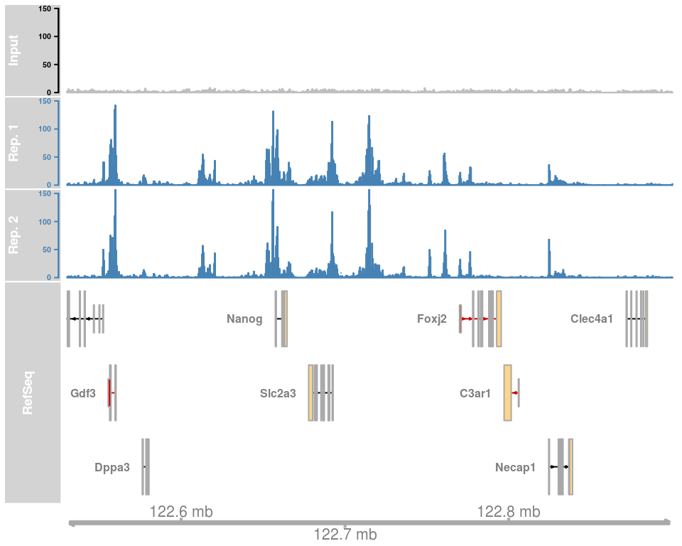

```{r, include = FALSE}
library(printr)
```


# Introduction

- What is ChIP-seq data?
- How is Diffbind used?
- What do we get from Diffbind?


# What is ChIP-seq data?

- ChIP-seq: Chromatin Immunoprecipitation sequencing
- Determine protein binding to genome


# What is differential binding analysis?




---

- Difference between the binding site in condition vs control
- Very similar to other differential analysis (differential expression analysis)


# Using Diffbind


---

### Downloading the sample data from the vignette

```{r, eval=FALSE}
url <- "https://content.cruk.cam.ac.uk/bioinformatics/software/DiffBind/DiffBind_vignette_data.tar.gz"
file <- basename(url)
options(timeout = 600)
download.file(url, file.path(".", file))
untar(file.path(".", file), exdir = ".")
```

---

### Examining the metadata

```{r}
head(read.csv("tamoxifen.csv"))[c("Condition", "bamReads")]
```


---


### Run the analysis
```{r cache=TRUE}
tamoxifen <- DiffBind::dba.analyze("tamoxifen.csv")
```

---

```{r}
DiffBind::dba.report(tamoxifen)
```


---

```{r, eval=FALSE}
tamoxifen <- dba(sampleSheet = "tamoxifen.csv") %>%
    +dba.blacklist() %>%
    +dba.count() %>%
    +dba.normalize() %>%
    +dba.contrast() %>%
    +dba.analyze()
```

---

```{r}
plot(tamoxifen)
```


---

```{r mychunk }
DiffBind::dba.show(tamoxifen, bContrasts = TRUE)
```
---

Using only the 246 Genes.

```{r}
plot(tamoxifen, contrast = 1)
```


# Plotting With DiffBind

- DiffBind Provides functions to plot aspects of the data.

---


- Gain: increase binding enrichment in the Resistant condition (Positive Fold Change)
- Loss: lower enrichment (Negative Fold Change)


```{r, out.width="50%"}
DiffBind::dba.plotVenn(tamoxifen, contrast = 1, bDB = TRUE, bGain = TRUE, bLoss = TRUE, bAll = FALSE)
```


---


```{r, out.width="70%"}
DiffBind::dba.plotPCA(tamoxifen, DiffBind::DBA_TISSUE, label = DiffBind::DBA_CONDITION)
```

---

### MA Plot

```{r, out.width="50%"}
DiffBind::dba.plotMA(tamoxifen)
```

---

```{r, out.width="50%"}
DiffBind::dba.plotVolcano(tamoxifen)
```


# Deliverables

- Table of differentially bound regions of the genome (binding sites)
- Plots


# Under the hood

- Either Deseq2 or EdgeR is used for differential binding analysis
- These tools are usually used for differentially expression analysis


---


## Deseq2 

- Fits a negative binomial distribution to the data
- Quantifies expected gene (or "read") variance from mean
- Genes that defy this expectation are considered "significant" 


# Conclusion


- What is ChIP-seq data?
- How is Diffbind used?
- What do we get from Diffbind?

---
 Diffbind utilizes commonly used differential expression analysis tools
 to determine differentially bound sites on the genome. 


